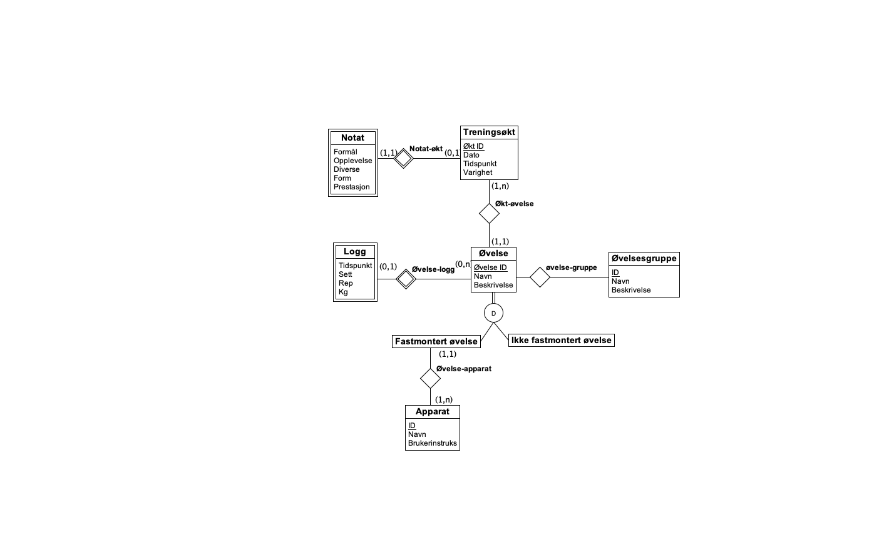

# Databaseprosjekt 2019

Julie Sydow Mo, Kari Lovise Ness og Martin Grønvold

## Database-prosjekt 1

ER-diagram

1.	Treningsdagboken skal være et verktøy som tillater en bruker å registrere egen treningsaktivitet. Dataen lagres i forskjellige tabeller. Informasjon om hver treningsøkt lagres i tabellene treningsøkt, resultat og notat. økt_id er tabellenes primærnøkkel, og knyttes til tabellene som omhandler informasjon om øvelsene gjennom bruker-økt-tabellen. Informasjon om øvelsene finnes i tabellen øvelse. Tabellen inneholder en boolsk verdi som definerer om øvelsen er fastmontert eller ikke-fastmontert. Informasjonen om apparatene finnes i tabellen apparat og knyttes til øvelse-tabellen gjennom øvelse-apparat-tabellen. Øvelsene i øvelse_apparat-tabellen er kun øvelsene med verdi 1 i fastmontert-attributten.
2.	For å finne de n sist gjennomførte treningsøktene med notater vil man gjennomføre et søk i tabellen treningsøkt. For å kunne ta ut de n siste treningsøktene sorterer vi tabellen på dato-tidspunkt. Den resulterende tabellen setter vi sammen med tabellene notat og resultat på nøkkelen økt_id.
3.	For at brukeren skal kunne se en resultatlogg i et gitt tidsintervall utfører vi først et søk på det gitte tidsintervallet i tabellen treningsøkt. Denne tabellen kan settes sammen med tabellen økt_øvelse. Ved hjelp av øvelses_id og økt_id kan vi trekke ut resultatloggene fra tabellen logg.
4.	De ulike øvelsene kan legges til i en flere øvelsesgrupper. Tabellen øvelsesgruppe har en oversikt over gruppene, med gruppe_id som primærnøkkel. øvelse-gruppe knytter informasjonen om grupper og øvelser sammen. Det vil si at dersom man setter sammen tabellene øvelse-gruppe og øvelse, og utfører et søk på en viss gruppe_id, vil man kunne finne øvelsene som er i samme gruppe.
5.	En bruker skal kunne finne ut hvor mye man har trent til sammen i forskjellige tidsintervaller. For å gjøre dette gjør man et søk på det gitte tidsintervallet i tabellen treningsøkt. Deretter summerer man varigheten på alle øktene.

## Relasjonsdatabasemodell (tabellform)

*[attributt] = primærnøkkel.

bruker

| *bruker_id | navn |
|---|---|

bruker_økt

| *bruker_id  | *økt-id |
|---|---|

treningsøkt

| *økt_id| dato-tidspunkt | varighet |
|---|---|---|

notat

| **økt_id | formål | opplevelse | diverse |
| --- | --- | ---- | --- |

resultat

| **økt_id | form | prestasjon |
|---|---| ---|

økt_øvelse

| *øvelse_id | *økt_id |
|---|---|

logg

| *økt_id | *øvelse_id  | sett | repetisjoner | kg |
|---|---|---|---|---|

øvelse

| *øvelse_id | navn | fastmontert
|---|---|---|

øvelse_gruppe

| *øvelse_id | *øvelsesgruppe-id
| --- | --- |

øvelsesgruppe

| * øvelsesgruppe_id  | navn | beskrivelse |
| --- | --- | --- |

apparat

|*apparat_id| navn | brukerinstruks |
| --- | --- | --- |

øvelse_apparat

| *apparat_id | *øvelse_id |
| --- | --- |
